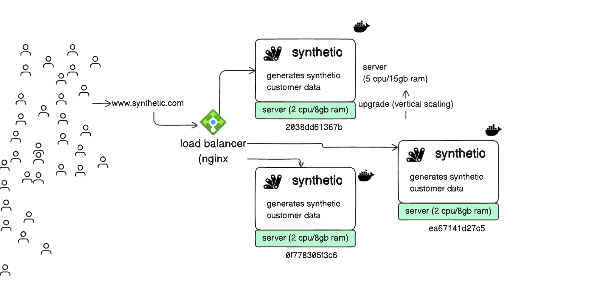

### Launching docker containers to simulate VM(s) that can help visualise load balancing
The fake/synthetic data is generated using a popular library called Faker

---

After you clone the repository, make sure you have Docker installed on your system. Docker comes pre-packaged with Docker compose, which we will use to launch all services in one-go
```
docker-compose up -d --build --scale synthetic=3
```
The above command should launch 3 docker containers each with their unique container id(s) which simulate an IP equivalent for a virtual machine on the cloud. To get the running container names and their IDs, you can use the following command:
```
docker ps --format "table {{.ID}}\t{{.Names}}"
```


You can access your app at `http://localhost/synthetic/` and it should give you responses such as the follows:

```
{
  "version": "1.0.0",
  "Request received": "2024-08-21 23:50:01.870198",
  "server_id": "2038dd61367b",
  "data": {
    "person_id": "55c649d6-6ff4-4b37-8105-58fdaf259fc3",
    "first_name": "Jill",
    "last_name": "Jones",
    "address": "05932 Bell Mountains Suite 135",
    "dob": "1997-01-06",
    "ssn": "710-79-6285"
  }
}
```